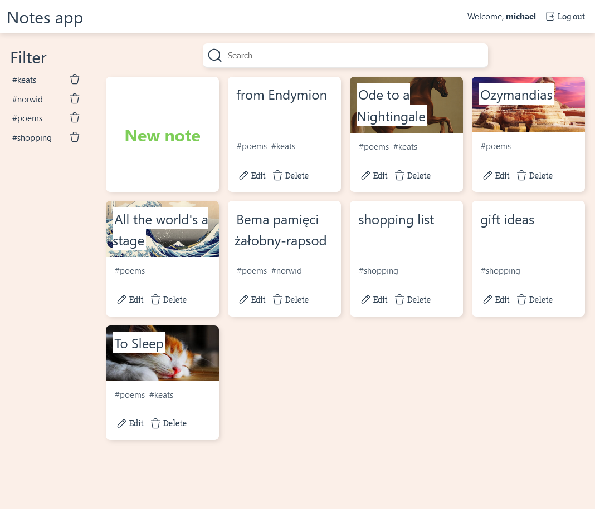
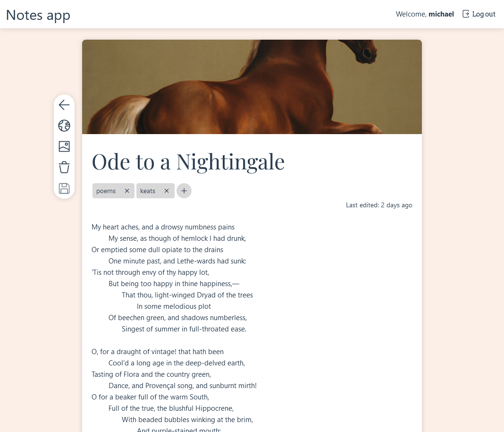

# Notes App

Very simple web app, made with Django + Vue.




## Features

* Basic user authentication using `django.auth`
* Main functionality implemented as pleasant-to-use, reactive 'single-page' Vue app, communication with the Django backend via its REST API
* Allows user to create, edit and delete simple text notes, optionally upload individual cover images as well as assign tags with an intuitive interface
* Notes set as public (lock/globe button in the edit view menu) may be viewed by anyone, including anonymous users by going to `/shared/<id>`
* Items on the main list view may be filtered by tag and by case-insensitive search on titles and contents of the notes

## Installation

The folder `myapp` contains the full application. In a python environment spcified by `myapp/requirements.txt`, run

```sh
python manage.py migrate
```

first, to create the database, and then

```sh
python manage.py runserver
```

to start the Django (development) server.

The `notes-front` folder contains the source code for the Vue-based frontend, which has been compiled and minified into the files seen in `mysite/static`.
